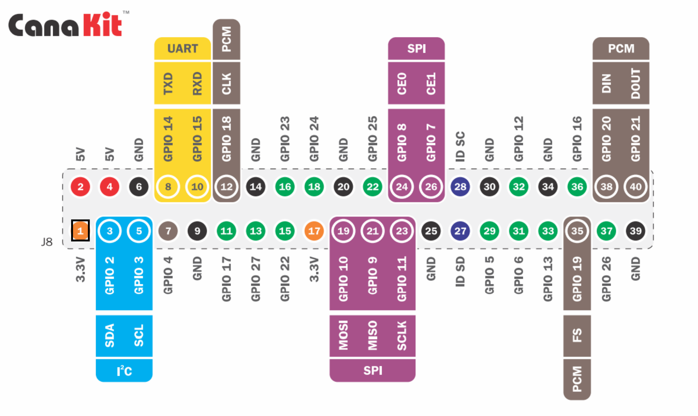
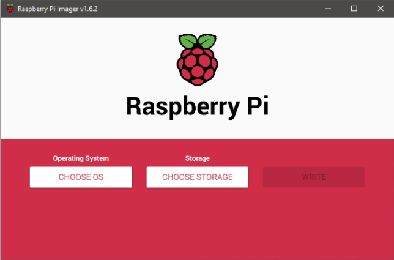
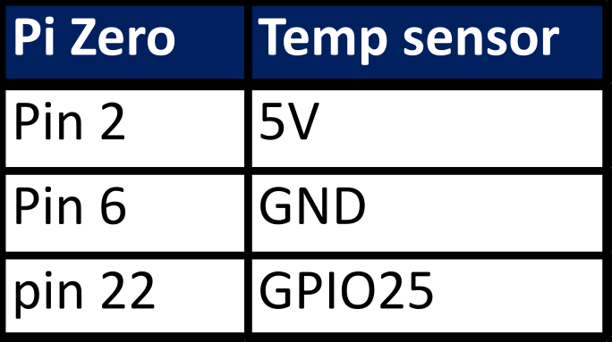

# Temperature-24h-Raspberry-Pi
Raspberry Pi Zero project is for monitor 24h temperature using W screen 2.8-inch display. Raspberry Pi OS (32-bits) based on Debian Linux distibution, allows to install Python plus libraries. With Linux and Python installed we are able read data from DHT22 temperature sensor and plot it in the 2.8-inch display. Basically for plotting we are using Matplotlib plus a function animation, the animation add one more valeus and re-plot the graph. Each interaction takes 1 minute. The sensor also provide humidity valeu in percentage but we are just ploting temperature.

Ploting temperatures values in the display is no complicated, actually that was the easier part. Since our intention is to left running for a long time, after five days running the RAM memory start increasing finally the Raspberry Pi collapse. After debugging and research about the issue, we discover Matplotlib plotting in a loop increase the SRAM memory. 
The solution was run an small paralle bash script which run the python code for 24 hours and kill it to avoid segmentation fauls, and run the python code again. Then RAM memory never reach the 100%. The way to kill the process is saving the ID process in a file PID.txt and read it every 24 hours. Each 24 hours there are 5 seconds of no plotting. I have the project working more than 20 days with no issues.  

This project is implemented for monitoring 24 hours in Python.

       

# Requirements

Raspberry Pi Zero --------------- W Screen 2.8-inch Display -------------- DHT22 Temperature Sensor 

   

https://www.amazon.com/gp/product/B071L2ZQZX/ref=ppx_yo_dt_b_asin_title_o08_s00?ie=UTF8&psc=1

Raspberry Pi Zero W Screen iUniker 2.8-inch 60+ fps 640x480
https://www.amazon.com/gp/product/B07H8ZY89H/ref=ppx_yo_dt_b_asin_title_o08_s00?ie=UTF8&psc=1

DHT22 / AM2302 Digital Humidity and Temperature Sensor Module
https://www.amazon.com/gp/product/B073F472JL/ref=ppx_yo_dt_b_asin_title_o01_s00?ie=UTF8&psc=1

MicroSD memory

# Relevant Information

Raspberry Pi Zero GPIO pin distribution

    

W Screen iUniker 2.8" GPIO pin distribution, Temperature Sensor pin distribution

   

# Instructions
- Create Raspberry Pi Linux image
- Sensor temperature connection and 2.8" display 
- Power up Raspberry with Linux
  - Install Python and libraries
- Test python project code
- Install W screen Display 2.8-inch
- Learn un-install LCD screen
- Reduce the brightness 
- Parallel bash code 

# Raspberry Pi Linux Image

Basically, the Raspberry Pi needs an Operating System (OS) in order to do any job. Then the microSD memory will store the OS, in this case is Raspbian.
In this section we will install the Raspbian in the microSD memory. 
Just go to www.raspberrypi.com/software/ and download "Raspberry Pi Imager v1.6"

Choose the right version:
-  Download for Windows
-  Download for macOS
-  Download for Ubuntu for x86

After download and install "Raspberry Pi Imager" open it and click in "CHOOSE OS", since is the first time, select "Raspberry Pi OS (32-bits)".
Next, select the storage: click in "CHOOSE STORAGE" and select your microSD memory. Finally click in "WRITE" to create the boot card. At the end, you will see something like this:

Now the microSD memory is ready to place in the Raspberry Pi Zero.   

# Sensor temperature connection and 2.8"Display

The table shows the pin assigment to connect the sensor tmeperature and the Raspberry Pi Zero. Solder first the 2.8" display with the Raspberry Pi Zero and later solder the cables of the sensor. If you are planning to use the Raspberry for other project also, I recomend use 2x20 Pin Female Header as extension, so you can remove the display easily.  

At this point, all hardware is connected and the operating system (Linux) is ready but the 2.8" display won't wake-up because there is not drivers installed. Let's power up and install Python, libraries and drivers.

# Power up Raspberry Pi Zero

Connect the mini HDMI cable to the monitor, also keyboard and mouse using usb hub, place the microSD memory and power up. Linux will prompt in your monitor. Now you can install Python and all libraries from the terminal.  

- Install Python 2.7

Install Libraries:

- Adafruit_DHT
- import time
- import psutil
- import numpy as np
- import matplotlib
- import sys
- import os.path
- import csv

After all library installed, is time to see the temperature graph in the big monitor.

# Booting Up on the W 2.8" screen display

After verifying functionality using regular monitor is time to change to 2.8" display.
From the terminal, go to the Raspberry folder and run the batch code "set_screen.sh"

$ ./set_screen.sh

The installation will reboot the system and your 2.8" display will be alive.
Now is time to run the temperature code.
From the terminal run "temp.sh"

$ ./temp.sh

# Python code

# Parallel Bash code

# Uninstall 2.8" screen display

# Brightness adjustment

