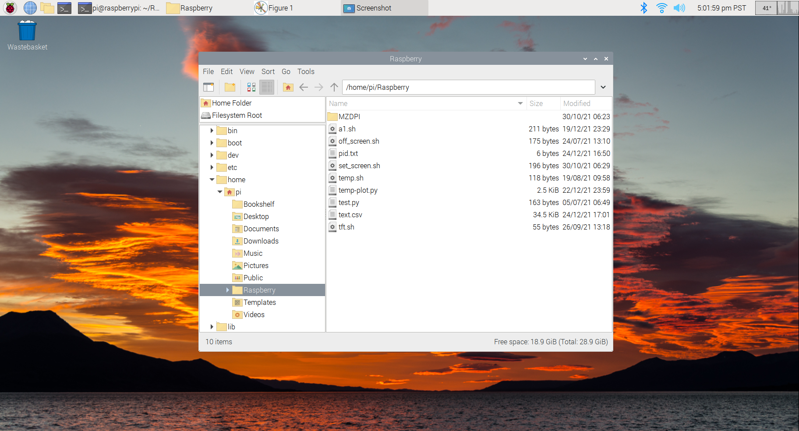
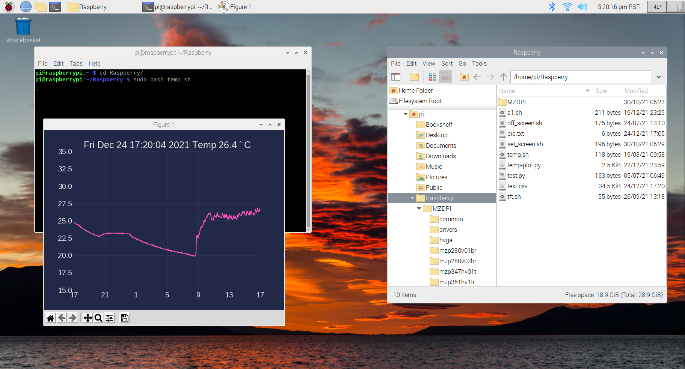
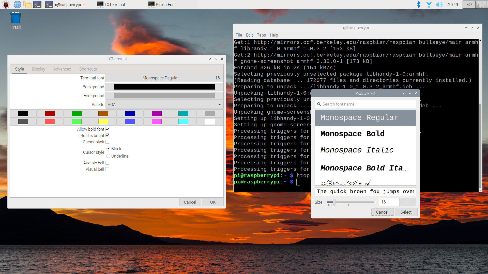

Raspberry Pi Monitoring Temperature 24h  
=======
Raspberry Pi Zero project is for monitoring 24h temperature with screen 2.8-inch display. Using Linux and Python we are able read data from DHT22 temperature sensor and plot it in the 2.8-inch display. Basically for plotting, we are using Matplotlib and update the plot every 60 seconds. The sensor also provide humidity values in percentage but we are just ploting temperature.

Ploting temperatures values in the display is no complicated, actually that was the easier part. Since our intention is to keep running for a long time (infinite loop), we discover after five days running, the RAM start increasing and finally the Raspberry Pi collapse (segmentation fault). After debugging and research about the issue, we discovered Matplotlib is causing this issue. 
The solution is run a paralle bash script which run the python code for 24 hours and kill it to avoid segmentation fauls and star again. We save the python code ID process in PID.txt file and read it later. So every 24 hours we startover and there are 30 seconds with no plot. I store all data ploted in text.csv file, so when the application start it will read the text.csv and contunue from there. I have the project working more than 20 days with no issues.  


       

# Requirements

Raspberry Pi Zero --------------- W Screen 2.8-inch Display -------------- DHT22 Temperature Sensor 

   


https://www.amazon.com/gp/product/B071L2ZQZX/ref=ppx_yo_dt_b_asin_title_o08_s00?ie=UTF8&psc=1

Raspberry Pi Zero W Screen iUniker 3.5 inch 60+ fps 640x480 (2.8" display is no longer available, 3.5" works fine)
https://www.amazon.com/gp/product/B07H8ZY89H/ref=ppx_yo_dt_b_asin_title_o08_s00?ie=UTF8&psc=1

DHT22 / AM2302 Digital Humidity and Temperature Sensor Module
https://www.amazon.com/gp/product/B073F472JL/ref=ppx_yo_dt_b_asin_title_o01_s00?ie=UTF8&psc=1

MicroSD memory

# Relevant Information

Raspberry Pi Zero GPIO pin distribution

    

W Screen iUniker 2.8" GPIO pin distribution, Temperature Sensor pin distribution

   

# Instructions
- Create image Raspberry Pi Linux 
- Connect the temperature sensor and 2.8" display 
- Power up Raspberry with Linux
  - Install Python and libraries
- Test python project code
- Install W screen Display 2.8-inch
- Learn un-install LCD screen 

# Raspberry Pi Linux Image

Basically, the Raspberry Pi needs an Operating System (OS) to work. Then, we use microSD memory to store the OS. In this case Raspberry use Linux Raspbian.
In this section we will install the Raspbian in the microSD memory of 32GbB. 
Just go to www.raspberrypi.com/software/ and download "Raspberry Pi Imager v1.6"

Choose the right version:
-  Download for Windows
-  Download for macOS
-  Download for Ubuntu for x86


After download and install "Raspberry Pi Imager" open it and click in "CHOOSE OS", since is the first time, I recomend install the full version (Python3 and libraries included). Then, select "Raspberry Pi OS FULL (32-bits)" which is under "Raspberry Pi OS (others)".


Next, select the storage: click in "CHOOSE STORAGE" and select your microSD memory. Finally, click in "WRITE" to create the boot card. At the end, you will see something like this:


Now, the microSD memory is ready to place in the Raspberry Pi Zero.   

# Temperature Sensor and 2.8"Display Connection

The table shows the pin assigment to connect the sensor temperature and the Raspberry Pi Zero. Solder first the 2.8" display with the Raspberry Pi Zero and later solder the cables of the sensor. If you are planning to use the Raspberry for other project also, I recomend use 2x20 Pin Female Header as extension, so you can remove the display easily.  


At this point, all hardware is connected and the operating system (Linux) is ready but the 2.8" display won't wake-up because there is not drivers installed. Let's power up and install Python and libraries.

# Power up Raspberry Pi Zero

Connect the mini HDMI cable to your monitor, I recomend connect your keyboard and mouse using usb hub. Now, place the microSD memory and power up. Linux will prompt in your monitor. 
Since is the first time booting, you need to follow the instructions to setup your language, local time, and other setting. At this point, the wifi connection is important, because you need to install libraries/drivers. If for some reason you are facing problems with the wifi connection, maybe the wifi chip is hot. Just let it coolling down.


Open the terminal and run the command for update (this is optional):
````sh
$ sudo apt update
````
Later
````sh
$ sudo apt full-upgrade
````
It will take longer, maybe 1 hour to finish.

Now you can install libraries for Python3 in the terminal. 

Install parallel
````sh
$ sudo apt install parallel
````
Install temperature sensor Libraries:

- Adafruit_DHT
````sh
$ sudo pip3 install Adafruit_DHT
````

Just in case there are no installed use the following commands (all these 3 libraries should be installed using full OS).

- Install psutil
````sh
$ sudo pip3 install psutil
````
- Install numpy as np
````sh
$ sudo pip3 install numpy
````
- Install matplotlib
````sh
$ sudo apt install python3-matplotlib
````

- Install screensaver (Disable the screen saver)
````sh
$ sudo apt install xscreensaver
````
Go to preference --> Screensaver, under Display Modes, select mode: Disable Screen Saver

- Install virtual keyboard (keyboard will be in accessories, in case you need it)
````sh
$ sudo apt install matchbox-keyboard
````


Increasing the Swap File on a Raspberry Pi

Increase the size of the swap file is important if we want to guarantee the functionallity.

Stop the OS using swap file:
````sh
$ sudo dphys-swapfile swapoff
````
we need to modify the swap file configuration file:
````sh
$ sudo nano /etc/dphys-swapfile
````
find the following line of text: Use CTRL + W to search the text within the file
````sh
CONF_SWAPSIZE=100
````
Replace With > 
````sh
CONF_SWAPSIZE=1024
````
save the file pressing CTRL + X and Y to confirm. Then setup the new size:
````sh
sudo dphys-swapfile setup
````
Now, turn the swap back on:
````sh
sudo dphys-swapfile swapon
````
reboot the Raspberry Pi:
````sh
sudo reboot
````

Now you will have 1GB of swap file.


After all library installed, is time to see the plot temperature in the big monitor.

Download the folder MZDPI and all files from codes section. Keep the same file organization. Create a folder called Raspberry and place all inside. You will have something like this:



If all is ok until this point we can run the main code, do the next steps:

change directory:
````sh
$ cd Raspberry
````
run the command:
````sh
$ sudo bash temp.sh
````

The plot will appears like this:



# Booting Up on the 2.8" screen display

After verifying functionality using regular monitor is time to change to 2.8" display. When you switch the monitor, the resolution change and is not easy to deal with the terminal. Before switch the monitor I recomend change the font size of the Terminal to 16.

In the terminal go to menu Edit-->Preference-->Style, click in the font, on the bottom, change the size to 16.




When you install the 2.8"display the system will reboot and your big monitor will no longer available. If you want the big monitor back again, you need to uninstall the 2.8"display. Since the project is plot the temperature all the time, all is ok.


From the terminal, go to the Raspberry folder and run the batch code "set_screen.sh" to install the 2.8"display.
````sh
$ sudo bash set_screen.sh
````
Now go to boot folder
````sh
$ cd /boot
````
Open the config.txt
````sh
$ sudo nano config.txt
````
Comment the following lines using #
````sh
display_auto_detect=1
dtoverlay=vc4-kms-v3d
max_framebuffers=2
disable_overscan=1
````
You will have somthing like this:


Now, save it CTRL + O and confirm. Use CTRL + X to exit from nano and finally reboot the system.

````sh
$ reboot
````
The reboot bring the 2.8" display be active. Now is time to run the temperature code.
From the terminal run "temp.sh"
````sh
$ sudo bash temp.sh
````

       
       

# Python code

When we call temp.sh (bash file):

````sh
while :
do
    parallel -j 2 < a1.sh
done
````

We are calling a parallel function that run 2 commands lines inside a1.sh (second bash file): 

````sh
echo "plotting"; python3 temp-plot.py
sleep 30; pidof python3 temp-plot.py > pid.txt; echo "sleeping"; sleep 24h; echo "killing"; pid=$(cat pid.txt) && kill -9 $pid; dphys-swapfile swapoff; dphys-swapfile swapon
````
The fisrts line is printing "plotting" and executing the main python code, which plot the temperature.
The second line...

# Parallel Bash code


# Uninstall 2.8" screen display

In case you need to uninstall the 2.8"display, turn off the system and remove the microSD card. Plug the microSD to windows pc and edit the config.txt file. Comment the last section [all] at the end of the file using #, like the following.


Save the config file and place the microSD back into the Raspberry Pi and Turn it on. The video signal is back to the mini HMDI port and your big monitor will works again. Remove all # that you inserted to get the 2.8" display back.

# Brightness adjustment (2.8" Display only)

In oreder to reduce the brightness of the 2.8" display, there are two pads that need to be in short circuit, solder this pins and run the bash code:
````sh
$ sudo bash tft.sh
````
You can modify the brightness from 0 to 100%, just open the file and edit the value, now is set at 80%
````sh
gpio -g mode 18 pwm
gpio pwmc 1000
gpio -g pwm 18 80
````


